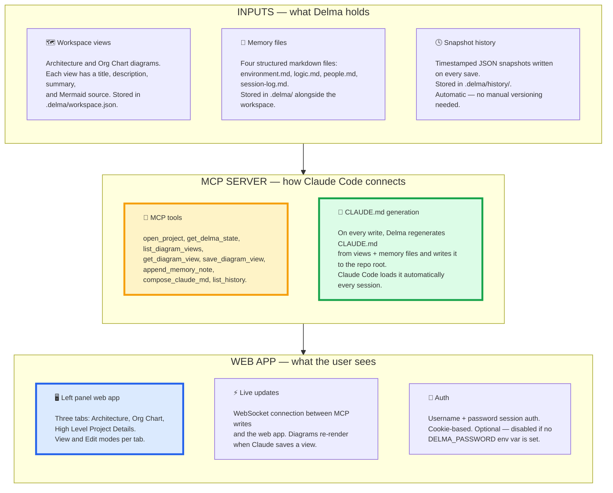
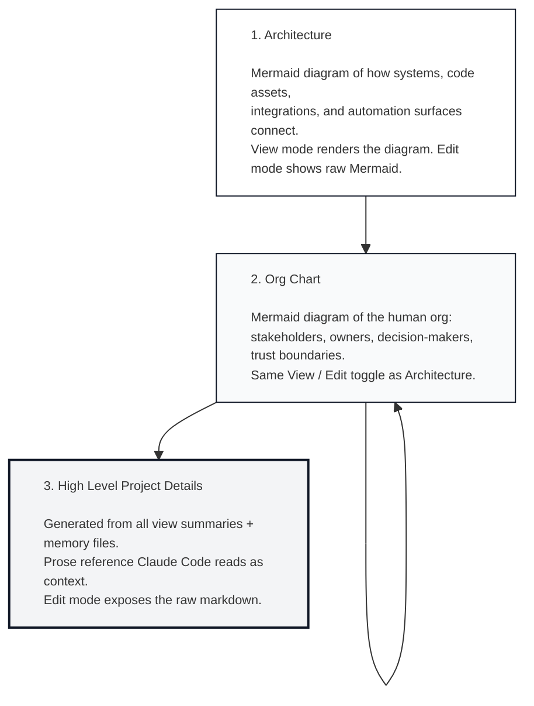
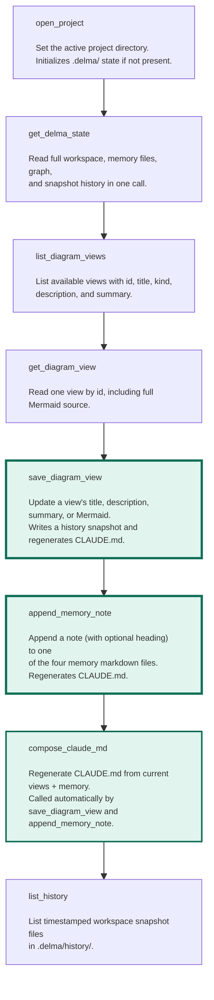

# Delma Live — the product that exists now

This is the canonical reference for the product as it exists in the
repo today.

Read this if you want to understand:
- what Delma is right now
- what the web app shows and does
- how the MCP server works and what tools it exposes
- how the workspace and memory files are structured
- why bidirectional editing is the core design constraint
- where the value already lives without any wrapper

For future features and product direction, see `docs/future.md`.

---

## 1. What Delma is right now

> **Delma is a persistent visual workspace for Claude Code: a web app
> that keeps your system map, diagrams, and project memory visible
> while Claude works — and updates live as Claude writes to it.**

The live product has three jobs:

- keep the shared workspace map visible beside Claude Code at all times
- give Claude Code a structured memory it can read from and write to via MCP
- update the visual layer in real time when Claude makes changes

This is not a chat interface. Claude Code is the agent. Delma is the
map it works from.

---

## 2. The Live Product At A Glance



---

## 3. What the Web App Shows

The left panel is the center of the live product.

It should feel like a live project dashboard, not a static doc.

The user should always be able to answer:

- what does this system look like right now
- what does the org or team structure look like
- what is the top-level status and what remains

That means three tabs, always visible, even before a workspace is loaded:



The View / Edit toggle is global — switching modes applies to all three
tabs, not just the active one. Switching tabs preserves the current mode
and saves any edits in progress.

---

## 4. The MCP Server Tools

The MCP server runs locally via `npm run start:mcp` (stdio transport).
Claude Code connects to it via `.mcp.json`.



---

## 5. The Workspace and Memory Structure

Every project Delma connects to gets a `.delma/` folder at its root.

```
.delma/
├── workspace.json       # Views: Architecture, Org Chart (titles, descriptions, Mermaid)
├── environment.md       # Tech stack, asset IDs, infrastructure, key identifiers
├── logic.md             # Business logic, routing, architecture decisions
├── people.md            # Ownership, stakeholders, tribal knowledge
├── session-log.md       # Status, what's done, what remains
├── CLAUDE.md            # Generated. Do not edit directly.
└── history/
    └── <timestamp>--<reason>.json   # Snapshot on every save
```

`CLAUDE.md` is regenerated on every write. It combines all view
summaries and memory file contents into a single file that Claude Code
loads automatically as project context each session.

This is the always-loaded cell of the memory grid. Claude Code sees the
full workspace state before the first message, every time.

---

## 6. Bidirectional Editing

Both Claude and the user are write-heads into the same `.delma/` files.
Neither owns the store — both can update it, and the diagram re-renders
either way.

**How it works:**

- User edits Mermaid directly in the web UI → saves → diagram re-renders
- Claude calls `save_diagram_view` or `append_memory_note` via MCP → files change →
  `fs.watch` detects the change → broadcasts via `/ws/live` WebSocket →
  browser calls `refreshWorkspace()` → diagram re-renders live

No polling. No manual refresh. Both write sources converge on the same
`.delma/` files as the single source of truth.

**Conflict model (V1):** last-write-wins. This is a single-user tool and
the conflict window is tiny. A history snapshot is written on every save,
so any overwrite is recoverable.

**Mermaid is the format.** It's human-readable enough to edit by hand and
machine-readable enough for Claude to write directly. No separate
markdown-to-diagram parser is needed.

---

## 7. MCP Call Logger

Every MCP tool call is logged to `.delma/mcp-calls.jsonl`
(newline-delimited JSON). Each line contains:

```json
{
  "timestamp": "2026-04-13T14:22:01.123Z",
  "tool": "append_memory_note",
  "input": { "file": "people.md", "note": "..." },
  "durationMs": 42,
  "success": true,
  "error": null
}
```

This log is the raw material for the analyzer app — it captures when
Claude calls MCP tools, what triggered the call, and how long it took.
It is excluded from `fs.watch` broadcasts so it doesn't cause UI
re-renders.

---

## 8. Claude Auto-Update Behavior

The generated `CLAUDE.md` includes explicit instructions telling Claude
to call MCP tools automatically during conversations — without being asked.

**Rules embedded in CLAUDE.md:**

- Call `get_delma_state` at the start of each conversation
- Call `append_memory_note` when the user confirms a fact about a person,
  role, ownership, or decision
- Call `save_diagram_view` when a structural relationship changes
- Only write what the user has explicitly stated or confirmed — never infer
- Batch updates: one call with all facts learned, not one call per fact

The CLAUDE.md is regenerated on every MCP write, so these instructions
are always current and always loaded.

---

## 9. Mermaid Error Handling

If a diagram has invalid Mermaid syntax:

- **In view mode:** the diagram area shows a styled error with the
  specific syntax problem
- **Before saving:** the save button validates first — broken Mermaid
  is blocked from saving with a status message explaining why
- **Recovery:** the last valid snapshot is always in `.delma/history/`

---

## 10. The Live Product Thesis

The live product is the MCP memory server plus the visual workspace layer
that makes it observable, bidirectional, and live.

In one sentence:

> **Delma is the persistent project memory Claude Code reads from and
> writes to — made visible as a live map you keep open beside your work,
> that both you and Claude can edit.**
