# Delma V1 — what we're building, why, and how it works

This is the canonical V1 reference for Delma.

Read this once and you should understand the product shape clearly:
what Delma is, what Claude Code is responsible for, why the diagrams
exist, what gets stored, how updates happen, and what the local system
is actually doing under the hood.

Plain English where it can be. Technical where it has to be. No code.

---

## 1. What Delma is, in one sentence

> **Delma is a local visual memory sidecar for Claude Code that keeps a set of beautiful, versioned Mermaid diagrams plus a managed `CLAUDE.md` in sync with your project.**

The important word is **sidecar**.

Delma is not trying to replace Claude Code. Claude Code is still the
main coding surface, the main agent, and the thing doing the work.
Delma exists beside it to make project understanding persistent,
visual, editable, and reusable across sessions.

---

## 2. The strategic bet

The bet behind Delma is that coding agents are getting strong enough
that the bottleneck is no longer raw code generation. The bottleneck is
**working memory**.

Developers do not just need a chat transcript. They need a durable,
editable system map that stays current as the project evolves. They
need something they can glance at in 10 seconds and feel oriented
again. They need something the agent can read too.

Delma is built on three connected bets:

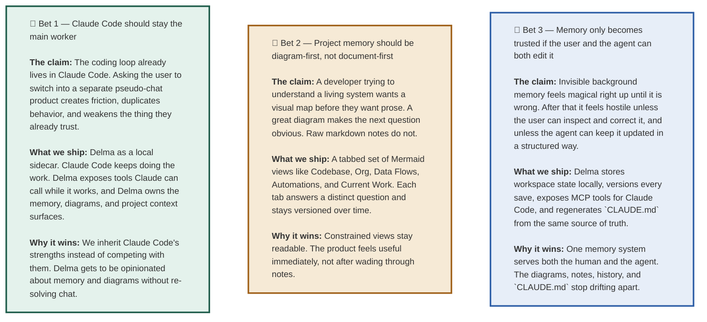

If those three bets are right, Delma becomes the durable project
understanding layer around Claude Code. Claude Code is the worker.
Delma is the living map.

---

## 3. The product in one mental model

There are only three actors in V1:

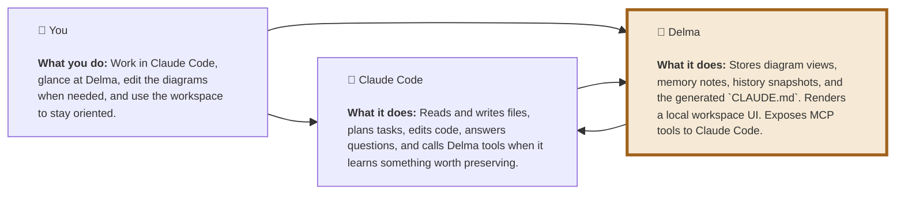

That is the whole shape.

Delma is not “another agent.” It is the memory system and visual
workspace that Claude Code can update.

---

## 4. The core user journey

Here is the V1 loop we are building around your real workflow.

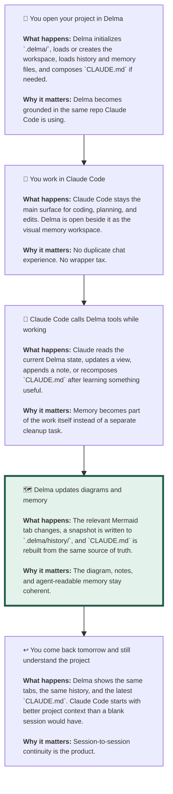

The success condition is simple:

you feel less blind when you start, and less forgetful when you come
back.

---

## 5. The five diagram tabs

Delma V1 does not revolve around one giant Mermaid.

It revolves around a **set of views**, each with a different job.
That is how the diagrams stay beautiful instead of turning into a
hairball.

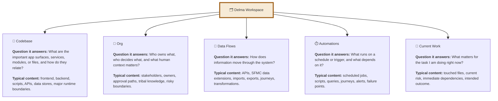

The product rule is that every tab needs a clear reason to exist.

If a tab does not answer a distinct question, it should not be a tab.
If a tab gets too broad to stay readable, it should split.

---

## 6. What Delma actually stores

Delma is local-first. Its value comes from keeping project memory near
the repo, visible on disk, and easy for both humans and agents to use.

```mermaid
flowchart TB
  workspace["📄 `.delma/workspace.json`<br/><br/><b>What it is:</b> The source of truth for Delma's diagram workspace.<br/><br/><b>What's inside:</b> project name, the list of view tabs, each view's title, description, summary, Mermaid body, and update timestamp.<br/><br/><b>Why it exists:</b> One structured file is easier to version, inspect, diff, and edit than a scattered set of opaque UI-only state."] 

  history["🕰️ `.delma/history/`<br/><br/><b>What it is:</b> Snapshot files written every time the workspace is saved.<br/><br/><b>What's inside:</b> the full workspace state, a timestamp, and a save reason.<br/><br/><b>Why it exists:</b> Versioning is a product feature, not a debug feature. Users need to know what changed and when."] 

  memory["📝 `.delma/*.md` memory files<br/><br/><b>What they are:</b> Supporting markdown notes like `environment.md`, `logic.md`, `people.md`, and `session-log.md`.<br/><br/><b>Why they exist:</b> Not every useful thing belongs as a diagram edge. These files hold supporting reference context and durable notes."] 

  graph["🧩 `.delma/graph.json`<br/><br/><b>What it is:</b> A placeholder canonical graph store for the next phase of Delma.<br/><br/><b>Why it exists now:</b> The architecture is being prepared for graph-backed view generation rather than raw text-only Mermaid editing forever."] 

  claude["📘 `CLAUDE.md` at project root<br/><br/><b>What it is:</b> The agent-readable memory surface that Claude Code can read naturally at session start.<br/><br/><b>How it is made:</b> Composed from the workspace views plus the memory markdown files.<br/><br/><b>Why it exists:</b> Delma improves Claude Code by feeding it better context, not by replacing it."] 

  workspace --> history
  workspace --> claude
  memory --> claude
  graph -.-> workspace

  classDef rich font-size:11px,text-align:left
  class workspace,history,memory,graph,claude rich
  style claude fill:#e7eef8,stroke:#2d5ea6,stroke-width:3px
```

The important principle is that the diagrams and `CLAUDE.md` come from
the same memory system. They should not drift into separate truths.

---

## 7. How Claude Code talks to Delma

Delma V1 is built around MCP because Claude Code already knows how to
use MCP servers. That makes the architecture cleaner and more durable
than trying to wrap the Claude CLI in a fake chat shell.

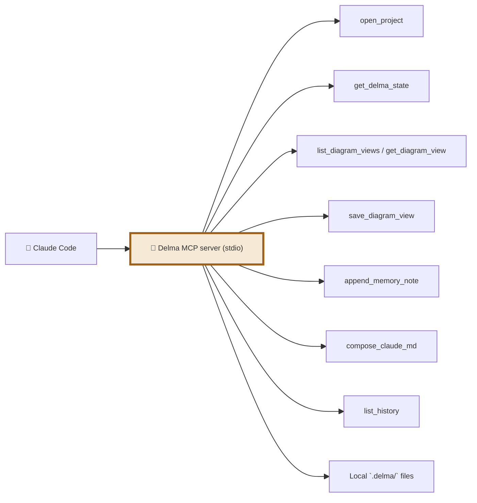

The system is intentionally simple.

Claude Code does not need a giant Delma API surface in V1. It needs a
small set of reliable operations that map directly to project memory
tasks.

---

## 8. The MCP tool contract

Each Delma MCP tool serves a clear user-facing job.

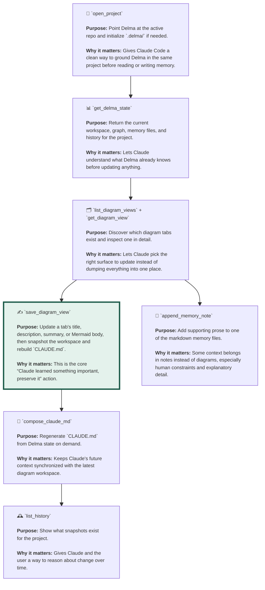

The central action is `save_diagram_view`.

That is the bridge between “Claude learned something” and “the project
now has better memory.”

---

## 9. The local web app

The local Delma web app is not the main coding tool anymore. It is the
workspace for the memory system.

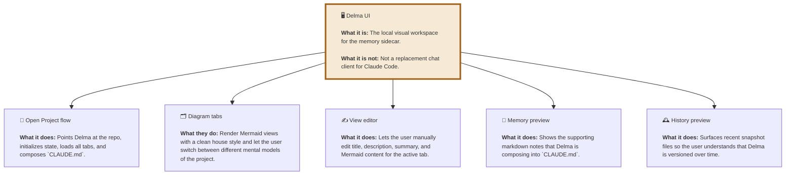

The UI exists for trust, editing, and orientation.

Claude Code may update Delma automatically, but the user still needs a
place to see and shape that memory directly.

---

## 10. The update pipeline

In V1, Delma supports both manual and agent-driven updates.

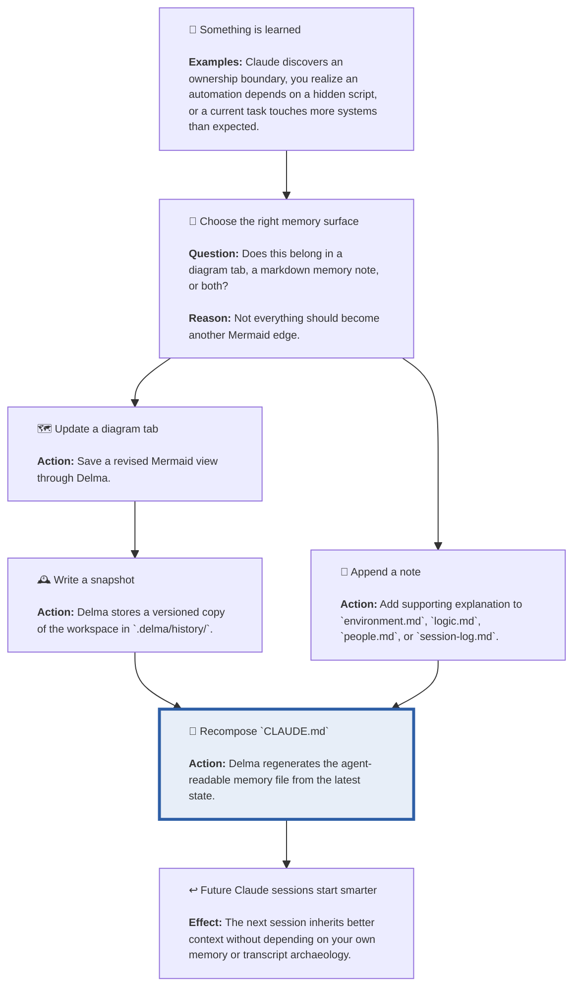

The key design choice is that `CLAUDE.md` is not hand-maintained.

It is the downstream artifact of Delma’s memory system, not a parallel
thing the user has to babysit.

---

## 11. Why versioning matters

Versioning is not a nice-to-have for Delma. It is one of the reasons
the product is worth using.

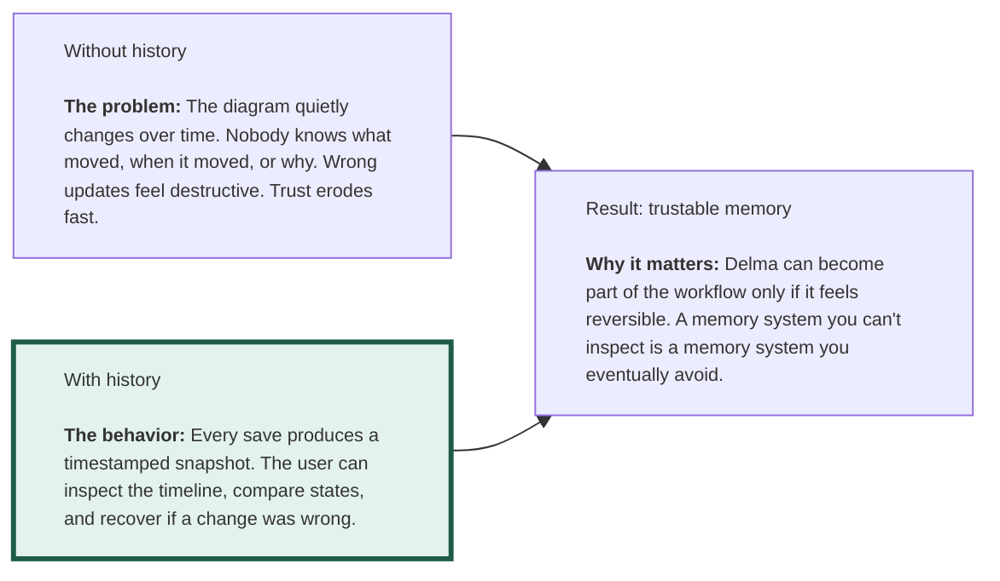

The longer the project lives, the more valuable that timeline becomes.

---

## 12. Why Mermaid matters

Delma uses Mermaid because it gives the product three advantages at
once:

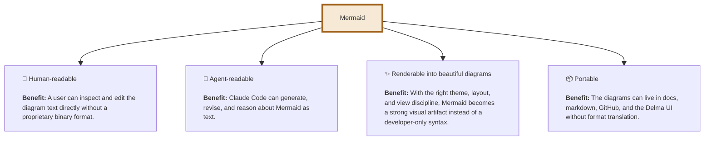

The product standard is not “generate any Mermaid.”

The standard is “generate Mermaid views that are clean enough to stay
open all day.”

---

## 13. The architecture

Here is the actual V1 system shape in one diagram.

```mermaid
flowchart TB
  user["👤 User"] 
  claude["🤖 Claude Code"] 
  mcp["🧰 Delma MCP server<br/><br/><b>Role:</b> Local stdio server that Claude Code calls for memory operations."] 
  web["🖥️ Delma local web app<br/><br/><b>Role:</b> Visual workspace for the same memory system."] 
  api["🌐 Delma local HTTP API<br/><br/><b>Role:</b> Opens projects, reads workspace state, saves views, and composes `CLAUDE.md` for the web app."] 
  state["📄 `.delma/workspace.json`"] 
  history["🕰️ `.delma/history/`"] 
  memory["📝 `.delma/*.md`"] 
  graph["🧩 `.delma/graph.json`"] 
  claudeMd["📘 `CLAUDE.md`"] 

  user --> claude
  user --> web
  claude --> mcp
  web --> api
  mcp --> state
  mcp --> history
  mcp --> memory
  mcp --> graph
  mcp --> claudeMd
  api --> state
  api --> history
  api --> memory
  api --> graph
  api --> claudeMd

  classDef rich font-size:11px,text-align:left
  class user,claude,mcp,web,api,state,history,memory,graph,claudeMd rich
  style mcp fill:#f6ead6,stroke:#a0611a,stroke-width:3px
  style claudeMd fill:#e7eef8,stroke:#2d5ea6,stroke-width:3px
```

The key point is that the MCP server and the web app share the same
state layer. There is not one memory system for the user and another
for Claude.

There is just Delma.

---

## 14. The V1 non-goals

Delma V1 is deliberately not trying to solve everything.

```mermaid
flowchart TB
  noChat["❌ Not a replacement for Claude Code chat<br/><br/><b>Reason:</b> Claude Code already owns the coding loop. Delma should not duplicate it."] 

  no3d["❌ Not a 3D office simulation product<br/><br/><b>Reason:</b> The visual centerpiece is now the diagram workspace, not animated agent theater."] 

  noCloud["❌ Not a cloud-first collaboration platform<br/><br/><b>Reason:</b> V1 is local-first and optimized for one user: you."] 

  noAutoEverything["❌ Not fully autonomous memory without user visibility<br/><br/><b>Reason:</b> Trust comes from inspectability, editability, and history."] 

  noUniversal["❌ Not a generic memory tool for every developer team yet<br/><br/><b>Reason:</b> V1 is optimized for your SFMC workflow and the way you actually work with Claude Code."] 

  classDef rich font-size:11px,text-align:left
  class noChat,no3d,noCloud,noAutoEverything,noUniversal rich
  style no3d fill:#fce7e7,stroke:#b24545,stroke-width:2px
```

The product gets better by being more opinionated, not more generic.

---

## 15. The success metric

The most important V1 question is:

> **Do you actually prefer working with Claude Code + Delma over Claude Code alone?**

Everything else is downstream of that.

The practical signals are:

1. You keep Delma open while working.
2. Claude Code starts using Delma memory naturally.
3. The diagrams stay current enough to be useful.
4. `CLAUDE.md` gets better instead of rotting.
5. Coming back to a project feels much less disorienting.

If Delma achieves that, V1 is working.

---

## 16. The TL;DR

1. **Claude Code remains the main worker.** Delma does not replace it.
2. **Delma is the local visual memory sidecar.** It owns diagrams, notes, history, and `CLAUDE.md`.
3. **The core artifact is a tabbed Mermaid workspace, not one giant graph.**
4. **Claude Code updates Delma through MCP tools while it works.**
5. **Every save is versioned.** History is part of the product.
6. **`CLAUDE.md` is generated from Delma state, not maintained by hand.**
7. **The whole point is continuity.** You and Claude should both start the next session smarter.

The product is not “another coding agent.”

The product is **persistent project understanding, living beside
Claude Code, in a form both you and the agent can use.**
